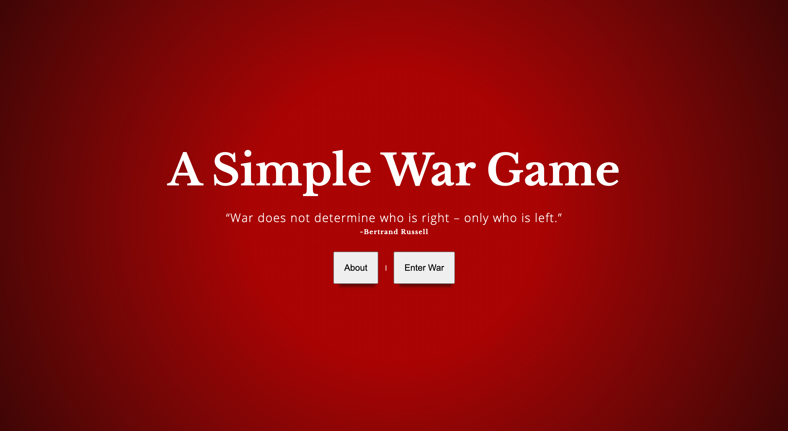

# A Simple War Game

## About

**deployed link:** https://simplewar.vercel.app

### **Created by:** 

Paula Bannerman

**Portfolio:** https://www.dcartist.studio

**LinkedIn:** https://www.linkedin.com/in/dcartist

**When:** built during the Mintbean hackathon
**Duration of Creation:** 1 week

## Installation Instructions

- Clone and download the project
- cd into the project 
- use `npm install` to install the react app
- use `npm run start` to start the project

## Game Play Instructions:

### War Game:

The object is to acquire all the cards, which you can do in different ways. To play War, you need the following:

- Two players
- A standard deck of 52 cards

Each player gets 26 cards.

For each round, one card is selected from each player. Whoever has the higher ranking card wins the round. The winner takes the loser's card. If both players have the same rank, War is activated. 

When War is activated, three cards from each player are placed into stasis, and then the 4th card is pulled to see who has the higher rank. The winner takes all the cards that both players played in that round.

**To Win:** You must reach the level of cards needed.

### Game Play

- Enter the game
- Enter the card limit that you wish to choose to base on who the winner is.
- Press the `Draw A card` button to view who won the match.
- If War has appeared, you will be asked to `draw cards` to see who won the match

## **Technologies Used:**

- React JS Framework (hooks and classes)
- Javascript
- React Router Transition

## Reasoning:

As a boot camp graduate from General Assembly DC Chapter (Sep. 2019) and a mentor to other boot camp students, I wanted to support them during this hackathon by creating my game. Also, I enjoy building apps. 

## Future Plans:

I plan on creating an API in express js that stores the tracked time of the game and the player's name. Also, have the players be able to select a profile picture. 